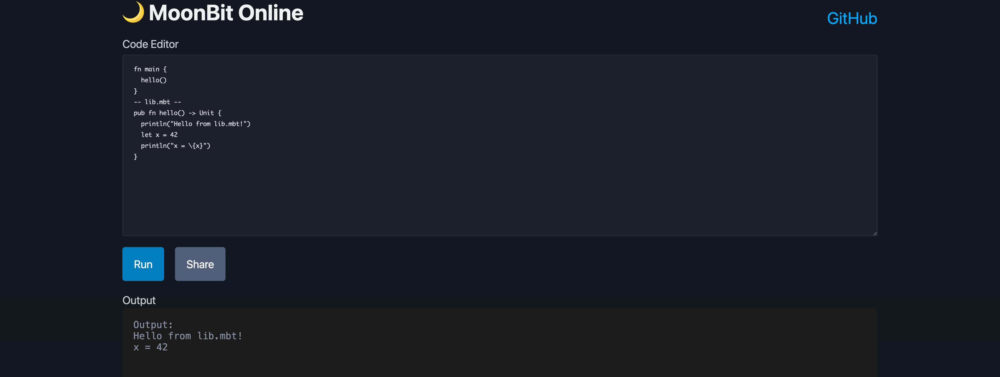

# 🌙 MoonBit Online

MoonBitのWASMコンパイラを利用したブラウザ上で動作するオンラインプレイグラウンド。

demo: https://podhmo.github.io/moonbit-online/



## 特徴

- 🌐 **完全ブラウザベース**: サーバーサイド不要、全ての処理がブラウザ内で完結
- ⚡ **高速コンパイル**: WASM版のMoonBitコンパイラを使用
- 📄 **複数ファイル対応**: go-playground方式で複数ファイルをサポート
- 🔗 **URL共有**: コードをURLエンコードして簡単に共有
- 🎨 **ダークモード**: 目に優しいダークテーマ
- 📱 **レスポンシブ**: モバイル・デスクトップ対応

## セットアップ

### インストール

```bash
git clone https://github.com/podhmo/moonbit-online.git
cd moonbit-online

npm install  # postinstallで自動的にWorkerファイルがpublicにコピーされます
npm run dev
```

ブラウザで `http://localhost:5173/` を開きます。

### ビルド

```bash
npm run build
```

ビルド成果物は `dist/` ディレクトリに生成されます。

## 使い方

### サンプルコード

エディタ右上のセレクトボックスから以下のサンプルを選択できます：

- **Hello**: シンプルな単一ファイルの例
- **Multiple Files**: 同一パッケージ内の複数ファイル
- **With Package Import**: 標準ライブラリ（@hashmap）の使用例

### 単一ファイル

通常のMoonBitコードを記述して実行します：

```moonbit
fn main {
  println("Hello, MoonBit!")
  let x = 42
  println("x = \{x}")
}
```

### 複数ファイル（go-playground方式）

`-- filename --`で区切ることで複数ファイルを扱えます：

```moonbit
fn main {
  hello()
}
-- lib.mbt --
pub fn hello() -> Unit {
  println("Hello from lib.mbt!")
}
```

より複雑な例：

```moonbit
fn main {
  let result = add(10, 20)
  println("10 + 20 = \{result}")
  
  let nums = [1, 2, 3, 4, 5]
  let total = sum(nums)
  println("Sum = \{total}")
}
-- lib.mbt --
pub fn add(a : Int, b : Int) -> Int {
  a + b
}

pub fn sum(arr : Array[Int]) -> Int {
  let mut total = 0
  for i = 0; i < arr.length(); i = i + 1 {
    total = total + arr[i]
  }
  total
}
```

### パッケージimport

[`@moonbitlang/core`](https://github.com/moonbitlang/core)の標準ライブラリパッケージを使用できます：

```moonbit
fn main {
  // Using @moonbitlang/core/hashmap
  let map = @hashmap.from_array([("a", 1), ("b", 2), ("c", 3)])
  println("Map: \{map}")
  
  map.set("d", 4)
  map.remove("a") |> ignore
  
  match map.get("b") {
    Some(v) => println("Value: \{v}")
    None => println("Not found")
  }
}
```

## 制限事項

現在のバージョンには以下の制限があります：

- 🔤 **基本的なエディタ**: シンタックスハイライト、コード補完はありません
- 📦 **単一パッケージ**: 複数パッケージのimportはできません（同一パッケージ内の複数ファイルは可能）

### サポート済み機能 ✅

- ✅ **標準ライブラリ**: `println`、配列、Option型などが使用できます
- ✅ **複数ファイル**: go-playground方式で同一パッケージ内の複数ファイルをサポート
- ✅ **@moonbitlang/core**: @hashmapなどの標準パッケージが使用可能
- ✅ **URL共有**: コードをURLで共有できます


## コーディングエージェント向け

### 振り返り

実際の作業の際には ./TODO.md を読み一つずつ作業を進めてください。そして完了した場合はチェックボックスをonにしてください。
必ず作業の最後にテストを実行して全てのテストが通ることを確認してください。


## 開発

### プロジェクト構造

```
moonbit-online/
├── src/
│   ├── app.tsx          # メインアプリケーションコンポーネント
│   ├── compiler.ts      # MoonBitコンパイラのラッパー
│   └── main.tsx         # エントリーポイント
├── public/              # 静的ファイル
├── docs/                # ドキュメント・スクリーンショット
├── index.html           # HTMLテンプレート
├── vite.config.ts       # Vite設定
├── tsconfig.json        # TypeScript設定
├── TODO.md              # タスクリスト
└── README.md            # このファイル
```

### コンパイルフロー

1. ユーザーがMoonBitコードを入力
2. `moonc-worker.js` の `buildPackage()` でパッケージをコンパイル
3. `linkCore()` でJavaScriptコードを生成
4. 生成したJavaScriptを専用Workerで実行し、`console.log`出力を取得
5. 結果を画面に表示

**技術的な詳細**:
- JS出力方式により標準ライブラリが自動的に含まれる
- Worker files（moonc-worker.js等）はpublic/に配置し、ルートパスから参照
- moonpad-monacoの実装を参考に、必要なcompile/run部分のみを利用

### URL共有の仕組み

コードは以下の手順でエンコード/デコードされます：

```typescript
// エンコード
const encoded = btoa(encodeURIComponent(code));
const url = `${origin}${pathname}#${encoded}`;

// デコード
const code = decodeURIComponent(atob(hash));
```

## 参考

- [MoonBit公式サイト](https://www.moonbitlang.com/)
- [MoonBit GitHub](https://github.com/moonbitlang)
- [moonpad-monaco](https://github.com/moonbitlang/moonpad-monaco) - 参考にした実装

---

詳しい仕様は [spec.md](./docs/prototype-spec.md) を参照してください。
作業状況は [TODO.md](./TODO.md) を参照してください。
