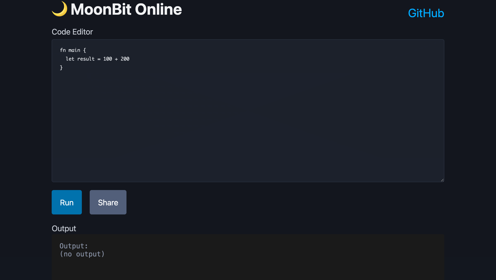

# 🌙 MoonBit Online

MoonBitのWASMコンパイラを利用したブラウザ上で動作するオンラインプレイグラウンド。



## セットアップ

### インストール

```bash
git clone https://github.com/podhmo/moonbit-online.git
cd moonbit-online

npm install
npm run dev
```

ブラウザで `http://localhost:5173/` を開きます。

### ビルド

```bash
npm run build
```

ビルド成果物は `dist/` ディレクトリに生成されます。

## 制限事項

現在のバージョンには以下の制限があります：

- 📄 単一ファイルのみ: 複数ファイルプロジェクトには対応していません
- 🔤 基本的なエディタ: シンタックスハイライト、コード補完はありません
- 📦 パッケージ管理: 外部ライブラリのインポートはできません

✅ 標準ライブラリはサポート済み: `println`、`print`などの標準関数が使用できます


## コーディングエージェント向け

### 振り返り

実際の作業の際には ./TODO.md を読み一つずつ作業を進めてください。そして完了した場合はチェックボックスをonにしてください。
必ず作業の最後にテストを実行して全てのテストが通ることを確認してください。
成功しても失敗しても常に「振り返り」をresults/`%Y%m%d-%H%M.md`-(ok|ng).mdに記録してください。「振り返り」とは ./prompts.md に書かれた振り返りのプロンプトの実行のことです。


## 開発

### プロジェクト構造

```
moonbit-online/
├── src/
│   ├── app.tsx          # メインアプリケーションコンポーネント
│   ├── compiler.ts      # MoonBitコンパイラのラッパー
│   └── main.tsx         # エントリーポイント
├── public/              # 静的ファイル
├── results/             # 振り返り・スクリーンショット
├── index.html           # HTMLテンプレート
├── vite.config.ts       # Vite設定
├── tsconfig.json        # TypeScript設定
├── TODO.md              # タスクリスト
└── README.md            # このファイル
```

### コンパイルフロー

1. ユーザーがMoonBitコードを入力
2. `@moonbit/moonpad-monaco`を使用してコンパイル（JS出力）
3. `moon.compile()` APIでJavaScriptコードを生成
4. `moon.run()` APIで実行し、ReadableStreamで出力を取得
5. 結果を画面に表示

**技術的な詳細**:
- JS出力方式により標準ライブラリが自動的に含まれる
- Worker files（moonc-worker.js, lsp-server.js等）はpublic/に配置し、ルートパスから参照
- moonbit-tourの実装を参考に、@moonbit/moonpad-monaco@0.1.202510171を使用

### URL共有の仕組み

コードは以下の手順でエンコード/デコードされます：

```typescript
// エンコード
const encoded = btoa(encodeURIComponent(code));
const url = `${origin}${pathname}#${encoded}`;

// デコード
const code = decodeURIComponent(atob(hash));
```

## 参考

- [MoonBit公式サイト](https://www.moonbitlang.com/)
- [MoonBit GitHub](https://github.com/moonbitlang)
- [moonpad-monaco](https://github.com/moonbitlang/moonpad-monaco) - 参考にした実装

---

詳しい仕様は [spec.md](./spec.md) を参照してください。
作業状況は [TODO.md](./TODO.md) を参照してください。
